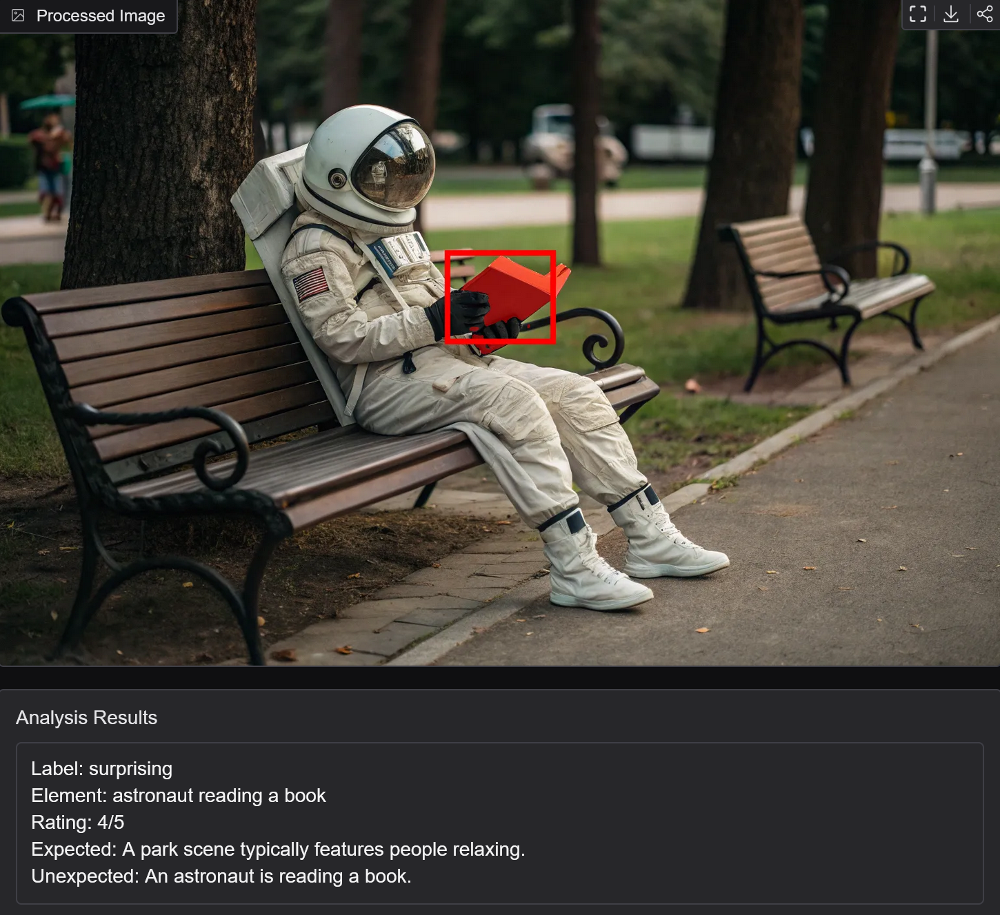

# Image Surprise Analyzer

This project offers a tool that identifies surprising elements in images, pinpointing what violates our expectations. It analyzes images for unexpected objects, locations, social scenarios, settings, and roles.


## Description

The Image Surprise Analyzer operates as a multi-stage pipeline to detect surprising elements in images. The process begins by feeding an input image to an LLM. The LLM analyzes the image and determines whether it contains any surprising elements. If so, it assigns a surprise level rating on a scale of 1 to 5 and provides text description of what is expected and unexpected about the scene. If the image is indeed deemed surprising, the LLM identifies and extracts the surprising element. This element then serves as a prompt to an object detection model, which locates the object in the image using bounding box. To further refine the detection, this bounding box is used as an input for the segmentation model. This model generates an accurate mask, highlighting the surprising element within the scene. Finally, the identified mask and bounding box are overlaid on the original image, and displayed alongside the text analysis provided by the LLM. 



## Technical Details

The system is a pipeline that integrates multiple models.
1. **LLM Analysis:** An image is input and given to the LLM. This LLM identifies the image's surprisingness, assigns a surprise level (1-5), and provides a textual explanation of what's expected versus unexpected.

    *   **Prompt:**
        ```
        Your task is to determine if the image is surprising or not surprising.
        If the image is surprising, determine which element, figure, or object in the image is making the image surprising and write it only in one sentence with no more than 6 words, otherwise, write 'NA'.
        Also rate how surprising the image is on a scale of 1-5, where 1 is not surprising at all and 5 is highly surprising.
        Additionally, write one sentence about what would be expected in this scene, and one sentence about what is unexpected.
        Provide the response as a JSON with the following structure:
        {
           "label": "[surprising OR not surprising]",
           "element": "[element]",
           "rating": [1-5],
           "expected": "[one sentence about what would be expected]",
           "unexpected": "[one sentence about what is unexpected]"
        }
        ```
        
3. **Object Detection:** If deemed surprising, the identified surprising element serves as a prompt for the `owlv2-base-patch16` object detection model. This returns a bounding box around the element in the image.
4. **Segmentation:** The bounding box from the detection model is used as a prompt to the `sam-vit-base` model for detailed segmentation. The model outputs a mask accurately outlining the surprising element.
5. **Overlay and Output:** The segmentation mask and bounding box are overlaid onto the original image, and shown with the analysis text. The resulting image and text are presented through the Gradio interface.

        
## Evaluation

To evaluate the performance of our different LLMs in identifying surprising images, a study was conducted. First, a set of images was created, which contained examples of surprising images and non-surprising images (300 images per class). Then, human labelers independently reviewed each image and determined whether it was surprising or not, and the degree of surprise on a likert scale from 1 to 5. This created a ground truth consensus for each image, allowing us to measure the models' performance.

The performance of different models was assessed for identifying surprising vs. non-surprising images. The following table shows some of the results with the best performing models:

| Model                                                 | Temperature | Accuracy | Surprising (Presicion) | Not-Surprising (Presicion) |
|-------------------------------------------------------|----------|----------|------------|----------------|
| `GPT-4o-mini`                            | 0.1      | 0.84     | 0.79       | 0.9            |
| `GPT-4o`                                  | 0.1      | 0.78 | 0.74       | 0.85           |
| `Llama-3.2-11B-Vision`                           | 0.1      | 0.62     | 0.83       | 0.57           |

This project is still under development, but contributions are welcomed to help improve its performance and capabilities.
